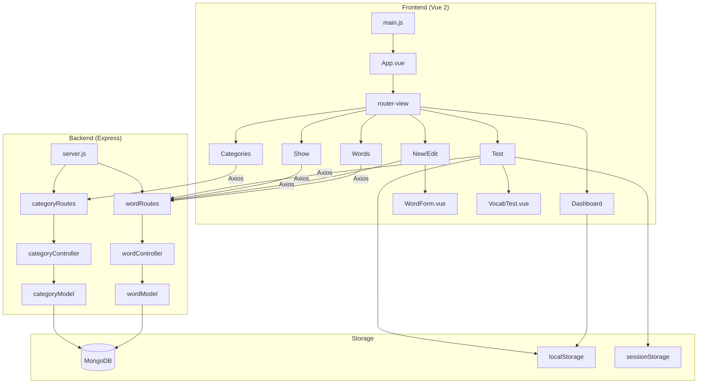
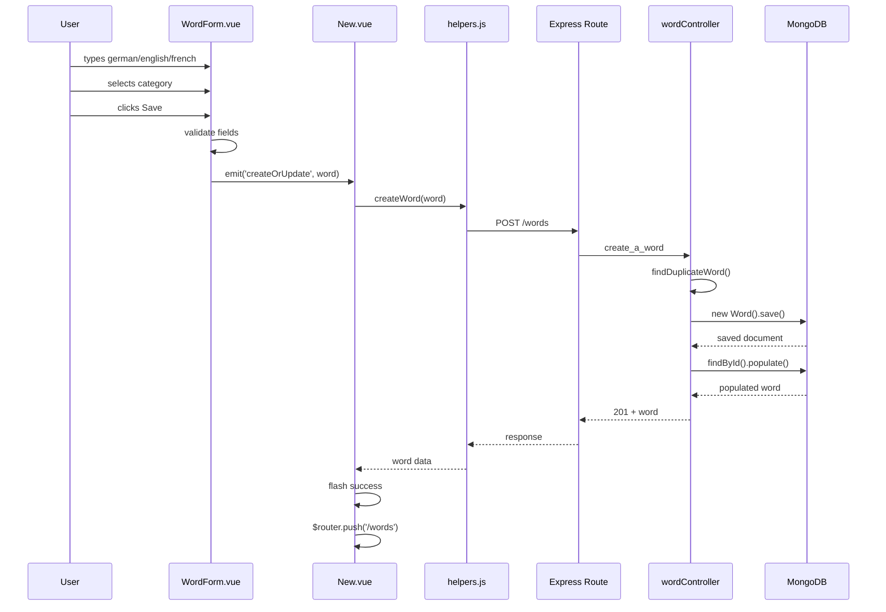
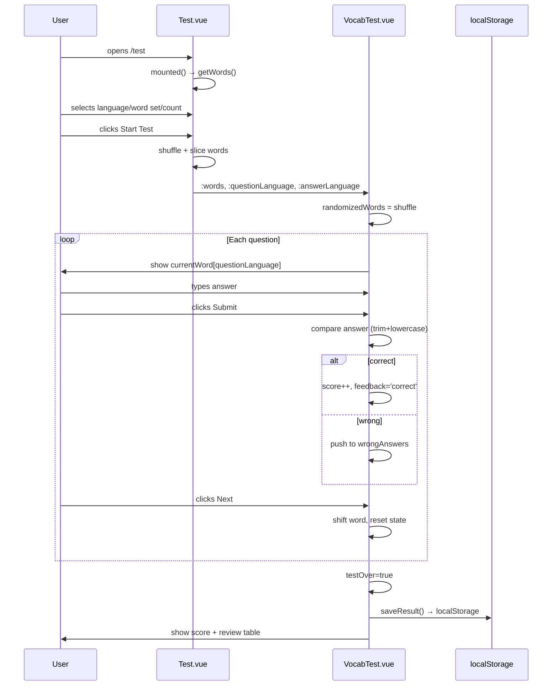

# PROJECT EVIDENCE AND VIDEO PLANNING DOSSIER
## COMP1842 — Vocabulary Builder — Mac Xuan Hoa (001361516)

---

# PART 1 — ASSIGNMENT REQUIREMENTS

## Brief Summary

| Requirement | Evidence in Project | Priority |
|---|---|---|
| Full-stack web application (Node.js + Vue.js + MongoDB) | `server/server.js` + `front-end/src/` | **Critical** |
| CRUD Operations for vocabulary words | `wordController.js`: create/read/update/delete | **Critical** |
| Category management | `categoryController.js` + `Categories.vue` | **Critical** |
| Search, Filter, Sort | `Words.vue` computed `filteredWords` | High |
| Favourite words | `wordModel.js` field `favourite` + toggle in Words/Show | High |
| Vocabulary Test/Quiz | `Test.vue` + `VocabTest.vue` | High |
| Dashboard with statistics | `Dashboard.vue` | High |
| Form validation | Frontend: `WordForm.vue`; Backend: Schema constraints | High |
| REST API | Express routes in `wordRoutes.js` + `categoryRoutes.js` | **Critical** |
| MongoDB with Mongoose | `wordModel.js`, `categoryModel.js` | **Critical** |
| Video ≤ 7 minutes | — | **Critical** |
| History mode routing | `router.js` mode: 'history' | Medium |
| About Me page | `AboutMe.vue` | Low |
| 404 Not Found page | `NotFound.vue` + catch-all route | Low |
| Speech synthesis | `Show.vue` + `Words.vue` speakWord() | Bonus |

## Learning Outcomes Demonstrated

| LO | Evidence |
|---|---|
| Build REST API with Express | `wordRoutes.js`, `categoryRoutes.js`, controllers |
| Design MongoDB schemas | `wordModel.js`, `categoryModel.js` |
| Vue.js SPA with components | 8 views + 2 reusable components |
| Client-server communication | `helpers.js` Axios wrappers |
| Browser storage usage | Dashboard localStorage, Test sessionStorage |

---

# PART 2 — PROJECT ARCHITECTURE

```
┌─────────────────────────────────────────────────────┐
│                    FRONTEND (Vue 2)                  │
│  port 8080 (dev) / static (build)                   │
│                                                      │
│  main.js → App.vue → router-view                    │
│  ├── Dashboard.vue                                   │
│  ├── Words.vue (list + search/filter/sort)          │
│  ├── New.vue → WordForm.vue                         │
│  ├── Edit.vue → WordForm.vue                        │
│  ├── Show.vue (detail + speech + favourite)         │
│  ├── Categories.vue (CRUD categories)               │
│  ├── Test.vue → VocabTest.vue                       │
│  ├── AboutMe.vue                                     │
│  └── NotFound.vue                                    │
│                                                      │
│  State: Vue data(), computed, watchers              │
│  HTTP: helpers.js (Axios)                           │
│  Storage: localStorage, sessionStorage              │
│  UI: Semantic UI CSS, vue-flash-message             │
└────────────────────┬────────────────────────────────┘
                     │ HTTP (REST)
                     ▼
┌─────────────────────────────────────────────────────┐
│                   BACKEND (Express)                  │
│  port 3000                                           │
│                                                      │
│  server.js → routes → controllers → models          │
│                                                      │
│  Routes:                                             │
│  /words          GET/POST     list_all/create_word   │
│  /words/:wordId  GET/PUT/DEL  read/update/delete    │
│  /categories     GET/POST     list_all/create_cat    │
│  /categories/:id PUT/DEL      update/delete_cat     │
│                                                      │
│  Middleware: cors(), bodyParser, 404 handler         │
└────────────────────┬────────────────────────────────┘
                     │ Mongoose
                     ▼
┌─────────────────────────────────────────────────────┐
│                MongoDB (localhost)                    │
│  Database: COMP1842_MacXuanHoa                       │
│                                                      │
│  Collection: words (model: Words)                    │
│  { german, english, french, category (ObjectId),    │
│    favourite (Boolean), created_date (Date) }        │
│                                                      │
│  Collection: categories (model: Categories)          │
│  { name (String), isDefault (Boolean) }              │
└─────────────────────────────────────────────────────┘
```

---

# PART 3 — PROJECT INVENTORY

| Layer | File | Responsibility | Key Methods/Sections |
|---|---|---|---|
| **Frontend Entry** | `front-end/src/main.js` | Vue app bootstrap | Vue.use(FlashMessage), new Vue({router, render}) |
| **Root Component** | `front-end/src/App.vue` | Layout, navbar, router-view | 6 nav links, flash-message, CSS |
| **Router** | `front-end/src/router.js` | SPA routing (history mode) | 10 routes, redirect `/` → `/dashboard` |
| **Helpers** | `front-end/src/helpers/helpers.js` | Axios API client | getWords, createWord, updateWord, deleteWord, getCategories, createCategory, updateCategory, deleteCategory |
| **Component** | `components/WordForm.vue` | Reusable word form (create+edit) | onSubmit(), toggleCategoryInput(), data: categories, selectedCategoryId, errorMessage, isAddingCategory, newCategoryName, submitting |
| **Component** | `components/VocabTest.vue` | Quiz session UI | submitAnswer(), nextQuestion(), saveResult(), 11 computed props |
| **View: Dashboard** | `views/Dashboard.vue` | Stats + quiz history + retake | totalWords, favouriteCount, categoryCount, quizHistory, recentAverage computed |
| **View: Words** | `views/Words.vue` | Word list + search/filter/sort | filteredWords computed, toggleFavourite(), deleteWordItem(), speakWord(), pagination |
| **View: New** | `views/New.vue` | Create word wrapper | createOrUpdate() → createWord() helper |
| **View: Edit** | `views/Edit.vue` | Edit word wrapper | mounted: getWord(), createOrUpdate() → updateWord() |
| **View: Show** | `views/Show.vue` | Word detail + speech | speakWord(), toggleFavourite(), deleteWordItem() |
| **View: Categories** | `views/Categories.vue` | Category CRUD UI | createNewCategory(), saveCategoryEdit(), deleteCategoryItem(), pagination |
| **View: Test** | `views/Test.vue` | Test setup + session orchestration | startTest(), exitTest(), retake handling, language/word set/count selection |
| **View: AboutMe** | `views/AboutMe.vue` | Student info + tech stack | Static data: technologies, coreFeatures, additionalFeatures |
| **View: NotFound** | `views/NotFound.vue` | 404 page | CSS-only component |
| **Backend Entry** | `server/server.js` | Express app + MongoDB connect | ensureDefaultCategory, middleware chain |
| **Word Routes** | `server/api/routes/wordRoutes.js` | /words REST endpoints | GET/POST /words, GET/PUT/DELETE /words/:wordId |
| **Category Routes** | `server/api/routes/categoryRoutes.js` | /categories REST endpoints | GET/POST /categories, PUT/DELETE /categories/:categoryId |
| **Word Controller** | `server/api/controllers/wordController.js` | Word CRUD logic | create_a_word, read_a_word, update_a_word, delete_a_word, findDuplicateWord |
| **Category Controller** | `server/api/controllers/categoryController.js` | Category CRUD logic | create_a_category, update_a_category, delete_a_category, isDefault protection |
| **Word Model** | `server/api/models/wordModel.js` | Mongoose schema: Words | german, english, french (String, required, trim, maxlength:80), category (ObjectId ref Categories), favourite (Boolean), created_date (Date) |
| **Category Model** | `server/api/models/categoryModel.js` | Mongoose schema: Categories | name (String, required, trim, minlength:2, maxlength:40), isDefault (Boolean, default:false) |

---

# PART 4 — FEATURE MATRIX

| Feature | Status | Frontend | Backend | Storage | Video? |
|---|---|---|---|---|---|
| Create Word | **Complete** | WordForm.vue → New.vue → createWord() | POST /words → create_a_word | MongoDB | **Must** |
| Read/List Words | **Complete** | Words.vue → getWords() | GET /words → list_all_words (+populate) | MongoDB | **Must** |
| Word Details | **Complete** | Show.vue → getWord(id) | GET /words/:id → read_a_word (+populate) | MongoDB | Yes |
| Update Word | **Complete** | WordForm.vue → Edit.vue → updateWord() | PUT /words/:id → update_a_word | MongoDB | **Must** |
| Delete Word | **Complete** | Words.vue/Show.vue deleteWordItem() | DELETE /words/:id → delete_a_word | MongoDB | Yes |
| French (3rd language) | **Complete** | WordForm, Words, Show, VocabTest | wordModel field french | MongoDB | Yes |
| Create Category | **Complete** | Categories.vue createNewCategory() | POST /categories → create_a_category | MongoDB | **Must** |
| Rename Category | **Complete** | Categories.vue saveCategoryEdit() | PUT /categories/:id → update_a_category | MongoDB | Yes |
| Delete Category | **Complete** | Categories.vue deleteCategoryItem() | DELETE /categories/:id → reassign words to default | MongoDB | Yes |
| Favourite Toggle | **Complete** | Words.vue/Show.vue toggleFavourite() | PUT /words/:id (partial: {_id, favourite}) | MongoDB | Yes |
| Search | **Complete** | Words.vue filteredWords computed | — (client-side) | Vue state | Yes |
| Filter by Category | **Complete** | Words.vue filteredWords computed | — (client-side) | Vue state | Yes |
| Filter by Favourite | **Complete** | Words.vue filteredWords computed | — (client-side) | Vue state | Yes |
| Sort (newest/oldest) | **Complete** | Words.vue filteredWords computed | — (client-side) | Vue state | Yes |
| Vocabulary Test | **Complete** | Test.vue + VocabTest.vue | GET /words (load words) | Vue + sessionStorage | **Must** |
| Quiz Scoring | **Complete** | VocabTest.vue score, submitAnswer() | — | Vue state | **Must** |
| Wrong-Answer Review | **Complete** | VocabTest.vue quiz-review table | — | Vue state | Yes |
| Dashboard | **Complete** | Dashboard.vue | GET /words + GET /categories | Vue + localStorage | **Must** |
| Quiz History | **Complete** | Dashboard.vue quizHistory | — | localStorage | Yes |
| Retake Test | **Complete** | Dashboard.vue retakeTest() → Test.vue retake | — | sessionStorage | Yes |
| Speech Synthesis | **Complete** | Show.vue + Words.vue speakWord() | — (Web Speech API) | Browser API | Bonus |
| Flash Messages | **Complete** | vue-flash-message in App.vue | — | Vue plugin | Yes |
| Validation | **Complete** | WordForm.vue + Schema constraints | Schema required/maxlength/minlength | — | Yes |
| About Me | **Complete** | AboutMe.vue | — | Static Vue data | If time |
| 404 Page | **Complete** | NotFound.vue + catch-all route | server.js 404 middleware | — | No |

---

# PART 5 — ROUTE AND RENDER FLOW

| URL | Route Name | View | Child Components | Purpose |
|---|---|---|---|---|
| `/` | — | redirect → /dashboard | — | Entry point |
| `/dashboard` | dashboard | Dashboard.vue | — | Stats + quiz history |
| `/words` | words | Words.vue | — | Word list + filters |
| `/words/new` | new-word | New.vue | WordForm.vue | Create word form |
| `/words/:id` | show | Show.vue | — | Word detail |
| `/words/:id/edit` | edit | Edit.vue | WordForm.vue | Edit word form |
| `/categories` | categories | Categories.vue | — | Category CRUD |
| `/test` | test | Test.vue | VocabTest.vue (conditional) | Quiz setup/session |
| `/about` | about | AboutMe.vue | — | Student info |
| `*` | not-found | NotFound.vue | — | 404 catch-all |

**Render Flow:**
```
User opens URL
→ main.js: new Vue({ router, render: h => h(App) }).$mount('#app')
→ App.vue renders: navbar (6 router-links) + <flash-message> + <router-view>
→ Vue Router matches route (history mode)
→ router-view renders matched view component
→ Component mounted() hook fires
→ Data fetched from API (getWords/getCategories/getWord)
→ Computed properties re-evaluate
→ Template re-renders with data
```

---

# PART 6 — DETAILED USER FLOWS

## Flow A: Create Word

**1. Starting Screen**
- Route: `/words/new`
- Vue page: `New.vue`
- Child: `WordForm.vue` (no :word prop → uses defaults)
- Initial data: `{ german:'', english:'', french:'', category:'', favourite:false }`
- Lifecycle: WordForm.mounted() → `getCategories()` → populates category dropdown

**2. User Actions**
- Types German word → `v-model.trim="word.german"`
- Types English word → `v-model.trim="word.english"`
- Types French word → `v-model.trim="word.french"`
- Selects category → `v-model="selectedCategoryId"` (value is category._id)
- Optional: clicks "New Category" → `isAddingCategory=true` → types name → `v-model.trim="newCategoryName"`
- Checks/unchecks Favourite → `v-model="word.favourite"`
- Clicks "Save word" → `@submit.prevent="onSubmit"`

**3. Frontend Processing**
- Method: `WordForm.onSubmit()`
- Validation: checks `!word.german/english/french` → shows errorMessage if empty
- `submitting = true` → button disabled
- If `isAddingCategory`: validates name, calls `createCategory({name})` → gets newCat._id
- Emits: `this.$emit('createOrUpdate', { german, english, french, category: categoryId, favourite, _id })`

**4. API Communication**
- Helper: `createWord(word)` in `helpers.js`
- HTTP: `POST /words`
- Body: `{ german, english, french, category, favourite }`
- File: `front-end/src/helpers/helpers.js`

**5. Backend Processing**
- Route: `wordRoutes.js` → `router.route('/words').post(wordController.create_a_word)`
- Controller: `wordController.create_a_word`
- Logic: extracts fields from req.body, if no category → finds default (`isDefault:true`), checks duplicate (`findDuplicateWord`), creates `new Word(req.body).save()`
- Model: `wordModel.js` — WordSchema enforces `required`, `trim`, `maxlength:80`
- Responses: 201 (created), 409 (duplicate), 400 (error)

**6. Data Persistence**: MongoDB → `words` collection

**7. Return Flow**
- Backend returns 201 with populated word `{ ...word, category: { _id, name, isDefault } }`
- New.vue receives → flashes "Word created successfully!" → `$router.push('/words')`
- Words.vue remounts, calls loadPageData(), list refreshes

**8. Flow Diagram:**
```
User types → v-model → word.german/english/french
User clicks Save → onSubmit()
  → validate → errorMessage OR
  → if new category: createCategory() → POST /categories
  → emit('createOrUpdate', {...})
  → New.vue: createWord() → Axios POST /words
  → Express: wordRoutes → wordController.create_a_word
  → findDuplicateWord() → if duplicate: 409
  → new Word(req.body).save() → MongoDB
  → populate → 201 response
  → flash success → router.push('/words')
```

---

## Flow B: Read/List/Search/Filter/Sort Words

**1. Starting Screen**
- Route: `/words`
- Vue page: `Words.vue`
- Data: `{ words:[], categories:[], searchText:'', selectedCategory:'', selectedFavouriteFilter:'all', selectedSortOrder:'newest', currentPage:1, pageSize:8 }`

**2. Lifecycle**
- `mounted()` → `loadPageData()` → `Promise.all([loadWords(), loadCategories()])`
- `loadWords()`: `getWords()` → `GET /words` → backend populates category → sets `this.words`
- `loadCategories()`: `getCategories()` → `GET /categories` → sets `this.categories`
- Computed `filteredWords` re-evaluates → `visibleWords` → template renders table

**3. User Actions**
- Types in search box → `v-model="searchText"` → watcher calls `resetPage()` → `filteredWords` recomputed
- Selects category filter → `v-model="selectedCategory"` → `filteredWords` filters by `word.category._id`
- Selects favourite filter → `v-model="selectedFavouriteFilter"` → filters by favourite
- Selects sort order → `v-model="selectedSortOrder"` → sorts by created_date
- Clicks star icon → `toggleFavourite(word)` → PUT /words/:id with `{_id, favourite: !current}`

**4. Computed Chain**
```
filteredWords:
  copy this.words → filter by searchText (client-side, 3-language search)
  → filter by selectedCategory (String(category._id) comparison)
  → filter by selectedFavouriteFilter (fav/normal/all)
  → sort by created_date (newest/oldest)
→ totalPages: Math.ceil(filteredWords.length / pageSize)
→ visibleWords: filteredWords.slice((page-1)*8, page*8)
→ paginationSummary: "Showing X–Y of Z words"
```

**5. Flow Diagram:**
```
User opens /words
→ Words.vue mounted → loadPageData → getWords() → GET /words → populate → words[]
→ getCategories() → GET /categories → categories[]
→ filteredWords computed → visibleWords computed → render table
User types search → searchText changes → watcher resetPage → filteredWords recomputed → re-render
```

---

## Flow C: View Word Details

**1. Route**: `/words/:id` → `Show.vue`
**2. mounted()**: `getWord($route.params.id)` → `GET /words/:id` → populate category
**3. Data**: `{ word: null }` → set to response
**4. Template**: Shows german/english/french readonly inputs, category label, favourite button, Edit/Delete buttons
**5. Speech**: `speakWord(text, langCode)` → Web Speech API `SpeechSynthesisUtterance`
**6. Favourite toggle**: `updateWord({_id, favourite: !current})` → PUT /words/:id (partial)

---

## Flow D: Edit Word

**1. Route**: `/words/:id/edit` → `Edit.vue` → `WordForm.vue` (with `:word="word"`)
**2. mounted()**: `getWord(id)` → sets `this.word` (populated)
**3. WordForm.mounted()**: detects `word.category` is object → extracts `_id` for select
**4. User changes fields, clicks Save → `onSubmit()` → emit → `Edit.vue.createOrUpdate()` → `updateWord(word)` → `PUT /words/:id`
**5. Backend**: finds word, checks duplicate (excluding self), updates fields, saves
**6. Response**: populated word → flash success → router.push('/words')

---

## Flow E: Delete Word

**Path 1 (from Words list):**
- User clicks trash icon → `deleteWordItem(word)` → `confirm()` → `deleteWord(word._id)` → `DELETE /words/:id`
- On success: filters word from `this.words` array locally → flash success

**Path 2 (from Show detail):**
- User clicks Delete → `confirm()` → `deleteWord(word._id)` → flash success → `$router.push('/words')`

---

## Flow F: Toggle Favourite

**From Words.vue:**
- Click star → `toggleFavourite(word)` → `updateWord({_id, favourite: !word.favourite})` → `PUT /words/:id`
- Backend: partial update (only favourite field changed)
- Response: populated word → splice into words array → flash "Added/Removed from Favourites"

**From Show.vue:**
- Click favourite button → same API call → update `this.word` → flash

---

## Flow G: Create Category

**1. Route**: `/categories` → `Categories.vue`
**2. User types name → clicks "Add"**
**3. Method**: `createNewCategory()` → trims name → if empty: flash error → `createCategory({name})` → `POST /categories`
**4. Backend**: `categoryController.create_a_category` → checks duplicate (case-insensitive via `.toLowerCase()`) → `new Category({name}).save()`
**5. Response**: 201 with category → flash success → `loadPageData()` refreshes list

---

## Flow H: Rename Category

**1. User clicks edit icon on a non-default category**
**2. `startCategoryEdit(cat)`**: sets `editingCategoryId`, `editingCategoryName`
**3. User types new name → Enter or Save**
**4. `saveCategoryEdit(catId)`**: `updateCategory({_id, name})` → `PUT /categories/:id`
**5. Backend**: finds category, checks not isDefault, checks duplicate (case-insensitive, excluding self), updates name
**6. Since Word stores category as ObjectId, no need to update words → just saves category

---

## Flow I: Delete Category

**1. User clicks trash on non-default category**
**2. `deleteCategoryItem(cat)`:**
   - Checks `cat.isDefault` → prevents
   - Checks `getWordsUsingCategory(cat._id) > 0` → shows "Cannot delete" if words exist
   - `confirm()` → `deleteCategory(cat._id)` → `DELETE /categories/:id`
**3. Backend**: finds category, checks not isDefault, finds default category, `Word.updateMany({category: cat._id}, {category: default._id})` → deletes category
**4. Response**: flash success → `loadPageData()` refreshes

---

## Flow J: Vocabulary Test Setup

**1. Route**: `/test` → `Test.vue`
**2. Data defaults**: `{ questionLanguage:'german', answerLanguage:'english', selectedWordSet:'all', selectedCategory:'', selectedQuestionCount:'all', customQuestionCount:5, isSessionActive:false, testWords:[] }`
**3. mounted()**: `getWords()` → words[], `getCategories()` → categories[], checks `sessionStorage('retake_word_ids')` → if exists: loads retake words, sets `isSessionActive=true` (skips setup)
**4. First render**: Shows setup form with language selects, word set, question count
**5. Language anti-collision**: `onQuestionLanguageChange()` auto-swaps answer if same

---

## Flow K: Answering Quiz Questions

**1. User clicks "Start Test" → `startTest()` → shuffles words → `testWords` set → `isSessionActive=true`**
**2. Template switches: v-if→v-else shows VocabTest component**
**3. VocabTest receives props: `:words="testWords"`, `:question-language="questionLanguage"`, `:answer-language="answerLanguage"`**
**4. data()**: `randomizedWords` (shuffled copy), `wrongAnswers:[], userAnswer:'', score:0, answeredCount:0, totalQuestions:words.length`
**5. computed `currentWord`**: `randomizedWords[0]`
**6. Dynamic property access**: `currentWord[questionLanguage]` (e.g., `currentWord['german']`) for question
**7. User types answer → `v-model="userAnswer"`**
**8. Submit → `submitAnswer()`:**
   - `currentWord[answerLanguage].trim().toLowerCase()` vs `userAnswer.trim().toLowerCase()`
   - Correct: `feedback='correct'`, score++
   - Wrong: `feedback='wrong'`, push to wrongAnswers
   - `waitingNext=true` → shows Next button
**9. Next Question → `nextQuestion()`:**
   - answeredCount++, feedback=null, waitingNext=false, userAnswer=''
   - `randomizedWords.shift()` (removes first word)
   - If empty: `testOver=true`, `saveResult()`
   - Else: focus input

---

## Flow L: Quiz Result/History

**1. saveResult() in VocabTest.vue:**
```js
const history = JSON.parse(localStorage.getItem('coursework03_quiz_history') || '[]');
history.unshift({ score, total: totalQuestions, timestamp: new Date().toISOString(), wordIds: words.map(w => w._id) });
if (history.length > 50) history.pop();
localStorage.setItem('coursework03_quiz_history', JSON.stringify(history));
```
**2. Stored in localStorage key**: `coursework03_quiz_history`
**3. Dashboard reads this**: `JSON.parse(localStorage.getItem('coursework03_quiz_history') || '[]')`

---

## Flow M: Retake

**1. Dashboard**: `retakeTest(attempt)` → stores `attempt.wordIds` in `sessionStorage('retake_word_ids')` → `$router.push('/test')`
**2. Test.vue mounted()**: reads `sessionStorage('retake_word_ids')` → filters `this.words` to match IDs → if found: sets `testWords` and `isSessionActive=true` (enters quiz directly)
**3. After use**: `sessionStorage.removeItem('retake_word_ids')`

---

## Flow N: Dashboard

**1. Route**: `/` redirects to `/dashboard`
**2. mounted()**: `getWords()` + `getCategories()` → computes totalWords, favouriteCount, categoryCount
**3. Quiz history**: reads from localStorage
**4. computed `recentAverage`**: averages last 5 quiz scores
**5. Template**: Stat row (total/favourites/categories) + History table (last 5 attempts) + Retake buttons

---

## Flow O: Speech Playback

**File**: `Show.vue` + `Words.vue`
**Method**: `speakWord(text, languageCode)`
```js
if (!text || !window.speechSynthesis) return;
const speech = new SpeechSynthesisUtterance(text);
speech.lang = languageCode;
window.speechSynthesis.speak(speech);
```
**Browser API**: Web Speech API (no backend)
**Languages**: en-US, de-DE, fr-FR

---

## Flow P: NotFound Page

- Catch-all route `*` → `NotFound.vue`
- Shows 404 icon, message, links to Dashboard and Library
- Backend also has 404 middleware

---

# PART 7 — TEST.VUE DEEP ANALYSIS

## First Render
1. `Test.vue` component created
2. `data()` initializes: all strings/numbers/booleans set to defaults
3. `isSessionActive` = false → v-if block renders setup form
4. computed `availableWords` returns `this.words` (still empty `[]`)
5. `availableWordCount` = 0
6. `favouriteWordCount` = 0
7. `hasValidQuestionCount` = true (default state)
8. Warning: "No words available. Add some words first."
9. Start button: disabled (availableWordCount < 5)

## mounted()
1. `getWords()` → sets `this.words`
2. `getCategories()` → sets `this.categories`
3. Checks `sessionStorage('retake_word_ids')`
4. If retake found: filters words, sets testWords + isSessionActive → enters quiz directly

## Reactive Updates (after data loads)
1. `words` changes → `favouriteWordCount` recomputed
2. `availableWords` recomputed (now has data)
3. `availableWordCount` recomputed
4. Warning disappears if count ≥ 5
5. Start button enables if ≥ 5 words
6. Category dropdown options appear

## Language Selection
- Both selects start different (german/english) → no collision
- If user makes them same: `onChange` handler auto-swaps the other
- Both watchers watch for infinite loop prevention

## Word Set Selection
- `all` → availableWords = all words
- `fav` → filter by favourite = true
- `category` → requires category selection, availableWords = 0 until selected
- Category count shown inline: computed dynamically

## Question Count
- Non-category mode: "All" or "Custom…"
- Custom: shows number input, `customQuestionCount` bound with `.number` modifier
- Watchers: clamp to max, fix NaN
- Validation: must be ≥ 5 and ≤ availableWordCount

## Start Test
1. `startTest()`:
   - limit = availableWordCount (or customQuestionCount if custom)
   - shuffle: `[...availableWords].sort(() => 0.5 - Math.random())`
   - slice(0, limit)
   - `this.testWords = randomWords`
   - `this.isSessionActive = true`
2. v-else renders VocabTest with props

## Exit Test
1. VocabTest emits `exitTest` (user clicks "Exit" or "Back to Setup")
2. Test.vue `exitTest()`: `isSessionActive = false`, `testWords = []`
3. Template switches back to setup form

---

# PART 8 — VOCABTEST.VUE DEEP ANALYSIS

## Props
| Prop | Type | Default | From |
|---|---|---|---|
| `words` | Array | required | Test.vue testWords |
| `questionLanguage` | String | 'german' | Test.vue questionLanguage |
| `answerLanguage` | String | 'english' | Test.vue answerLanguage |

## Data Initialization
```js
randomizedWords: [...this.words].sort(() => 0.5 - Math.random())  // shuffled copy
wrongAnswers: []          // { word, guess } for review
userAnswer: ''            // bound to input
score: 0                  // correct count
answeredCount: 0          // questions answered
totalQuestions: this.words.length  // fixed at init
testOver: false           // toggles result screen
feedback: null            // 'correct' | 'wrong' | null
lastCorrectAnswer: ''     // shown when wrong
waitingNext: false        // toggles Submit/Next button
languageDetails: { german:{name,code,flag}, english:{...}, french:{...} }
```

## Computed Properties (11 total)
- `currentWord`: `randomizedWords[0]` or null
- `progressPercent`: `(answeredCount/totalQuestions)*100`
- `scorePercent`: `(score/totalQuestions)*100`
- `feedbackClass`: 'positive'/'negative' based on feedback
- `feedbackIcon`: check/times circle icon
- 6× language details: name, code, flag for question + answer languages

## Answer Flow
1. User types → `v-model="userAnswer"`
2. Clicks Submit → `submitAnswer()`
3. Compare: `currentWord[answerLanguage].trim().toLowerCase()` vs `userAnswer.trim().toLowerCase()`
4. Exact match required (case-insensitive, trimmed)
5. Correct: feedback='correct', score++, lastCorrectAnswer set
6. Wrong: feedback='wrong', push `{word: currentWord, guess: userAnswer}`, lastCorrectAnswer set
7. `waitingNext = true` → button changes to "Next Question"
8. Next click → `nextQuestion()`: answeredCount++, reset feedback/userAnswer, shift randomizedWords
9. If empty → testOver=true, saveResult() → localStorage

## Result Display
- Score: X out of Y (Z%)
- If wrong answers: table with Word | Your Answer | Correct Answer
- If perfect: "Perfect score!" message
- "Back to Setup" button emits `exitTest`

## History Storage
- localStorage key: `coursework03_quiz_history`
- Format: `[{ score, total, timestamp, wordIds: [...] }]`
- Max 50 entries (oldest removed)
- New entries prepended (unshift)

---

# PART 9 — STORAGE MAP

| Data | Created By | Stored In | Persistence | Read By | Modified By |
|---|---|---|---|---|---|
| Words | POST /words | MongoDB `words` | Permanent | GET /words, Test.vue | PUT/DELETE /words |
| Categories | POST /categories | MongoDB `categories` | Permanent | GET /categories, WordForm | PUT/DELETE /categories |
| Form data | User input | Vue component state | Until navigation | WordForm template | v-model |
| Search text | User input | Vue component state | Until navigation | filteredWords computed | v-model + resetPage |
| Filter state | User select | Vue component state | Until navigation | filteredWords computed | v-model |
| Quiz setup | User select | Vue component state | Until navigation | Test.vue template/computed | v-model |
| Quiz words | startTest() | Vue component state | Until exit | VocabTest | nextQuestion shifts |
| Current answer | User input | Vue component state | Until next question | submitAnswer | v-model |
| Score | submitAnswer | Vue component state | Until exit | Template, computed | submitAnswer increments |
| Wrong answers | submitAnswer | Vue component state | Until exit | Review table | push per wrong answer |
| Quiz history | VocabTest.saveResult | localStorage | Permanent (max 50) | Dashboard.vue | saveResult unshift |
| Retake word IDs | Dashboard.retakeTest | sessionStorage | Until consumed | Test.vue mounted | Removed after read |
| Favourite | toggleFavourite | MongoDB `words` | Permanent | Words, Show, Dashboard | PUT /words/:id |
| Dashboard stats | mounted | Vue state | Until navigation | Template | mounted fetch |

**Key:**
- **Permanent**: MongoDB data
- **Session**: localStorage (survives close/reopen), sessionStorage (tab-only)
- **Component-only**: Lost on route change or refresh

---

# PART 10 — FRONTEND/BACKEND RESPONSIBILITIES

## Frontend Responsibilities
- Rendering UI with Vue 2 + Semantic UI CSS
- Form state management (v-model)
- Client-side validation (empty fields, category name)
- Search, filter, sort (all computed properties, no API call)
- Quiz session logic (shuffle, score, progress)
- Browser storage (localStorage for history, sessionStorage for retake)
- Speech synthesis (Web Speech API)
- Flash messages (vue-flash-message plugin)
- Router navigation (history mode)

## Backend Responsibilities
- REST API endpoints (Express routes)
- Server-side validation (Schema required/maxlength)
- Data normalization (Schema trim)
- MongoDB CRUD operations (Mongoose)
- Duplicate word detection (`findDuplicateWord`)
- Category default protection (`isDefault` flag)
- Referential integrity (delete category → reassign words to default)
- HTTP status codes and error responses
- CORS handling
- 404 fallback

| Behaviour | Frontend | Backend | Storage |
|---|---|---|---|
| Create word | Form + validation + Axios POST | Express route → controller → Mongoose save | MongoDB |
| Search words | filteredWords computed (in-memory) | — | Vue state |
| Quiz answer checking | submitAnswer() compares strings | — | Vue state |
| Quiz history save | saveResult() writes | — | localStorage |
| Quiz history read | Dashboard.vue reads | — | localStorage |
| Retake | Dashboard writes IDs | — | sessionStorage |
| Category rename | UI + Axios PUT | Controller updates name only | MongoDB |
| Category delete | UI + confirmation | Controller reassigns words + deletes | MongoDB |
| Speech | speakWord() Web Speech API | — | Browser |

---

# PART 11 — CODE EVIDENCE INDEX

| Video Topic | File | Function/Section | What to Highlight |
|---|---|---|---|
| App bootstrap | `front-end/src/main.js` | `new Vue({ router, render })` | Vue app creation, plugin registration |
| Router | `front-end/src/router.js` | Full router config | 10 routes, history mode, lazy loading |
| Navbar | `front-end/src/App.vue` | Template lines 1-30 | 6 router-links, flash-message, router-view |
| API helpers | `front-end/src/helpers/helpers.js` | All exports | Axios instance, baseURL, 8 helper functions |
| Word form | `components/WordForm.vue` | `onSubmit()` method | v-model, validation, category select, emit |
| Create handler | `views/New.vue` | `createOrUpdate()` | Receives emit, calls createWord |
| Word route | `server/api/routes/wordRoutes.js` | POST /words | Route → controller mapping |
| Word controller | `server/api/controllers/wordController.js` | `create_a_word` | Default category, duplicate check, save + populate |
| Word schema | `server/api/models/wordModel.js` | WordSchema | german/english/french/category/favourite fields |
| Test setup | `views/Test.vue` | `startTest()`, `mounted()` | Language/word set/count selection, retake read |
| Test mounted | `views/Test.vue` | `mounted()` | getWords, getCategories, sessionStorage check |
| VocabTest props | `components/VocabTest.vue` | Props definition | words, questionLanguage, answerLanguage |
| Answer check | `components/VocabTest.vue` | `submitAnswer()` | trim+toLowerCase comparison, score increment |
| Quiz history | `components/VocabTest.vue` | `saveResult()` | localStorage write |
| Dashboard history | `views/Dashboard.vue` | `mounted()` | localStorage read, quizHistory |
| Retake | `views/Dashboard.vue` | `retakeTest()` | sessionStorage write |
| Category rename | `server/api/controllers/categoryController.js` | `update_a_category` | isDefault check, duplicate check |
| Category delete | `server/api/controllers/categoryController.js` | `delete_a_category` | isDefault check, Word.updateMany |
| Speech | `views/Show.vue` | `speakWord()` | Web Speech API usage |
| Server entry | `server/server.js` | Full file | Express setup, MongoDB connect, default category |

---

# PART 12 — DEMO DATASET

Prepare these before recording:

| # | German | English | French | Category | Favourite |
|---|---|---|---|---|---|
| 1 | Haus | house | maison | General | No |
| 2 | Hund | dog | chien | General | Yes |
| 3 | Katze | cat | chat | General | Yes |
| 4 | Buch | book | livre | General | No |
| 5 | Tisch | table | table | General | No |
| 6 | Flugzeug | airplane | avion | Travel | Yes |
| 7 | Zug | train | train | Travel | Yes |
| 8 | Flughafen | airport | aéroport | Travel | No |
| 9 | Restaurant | restaurant | restaurant | Food | Yes |
| 10 | Brot | bread | pain | Food | No |
| 11 | Wasser | water | eau | Food | No |
| 12 | Apfel | apple | pomme | Food | No |
| 13 | Schule | school | école | Education | No |
| 14 | Lehrer | teacher | professeur | Education | No |
| 15 | Fenster | window | fenêtre | General | No |

**Categories**: General (default), Travel, Food, Education
**Favourites**: Hund, Katze, Flugzeug, Zug, Restaurant (5)
**Edit target**: #15 Fenster → change to "Tür" (door)
**Delete target**: #14 Lehrer
**Empty category for delete demo**: Education (after deleting Lehrer)
**Rename demo**: Travel → "Journey"

---

# PART 13 — VIDEO EVIDENCE PRIORITIES (6:45 max)

| Feature | Priority | Seconds | Browser Demo | Code Explanation |
|---|---|---|---|---|
| Architecture overview | Must | 30s | Diagram | server.js, router.js |
| Dashboard (stats) | Must | 25s | Show dashboard | Dashboard.vue mounted |
| Create Word flow | Must | 45s | Type + save word | WordForm → New → helpers → route → controller → model |
| Words list + search/filter | Must | 30s | Search, filter, sort | Words.vue filteredWords computed |
| Edit Word | Must | 20s | Edit a word | Edit.vue → WordForm |
| Delete Word | Must | 15s | Delete a word | Words.vue deleteWordItem |
| Category CRUD | Must | 35s | Create, rename, delete | Categories.vue + categoryController |
| Vocabulary Test | Must | 50s | Setup, answer, result | Test.vue + VocabTest |
| Quiz history + Retake | Must | 25s | Dashboard history, retake | localStorage, sessionStorage |
| Full-stack Create code walk | Must | 40s | Open 6 files | WordForm → New → helper → route → controller → model |
| Favourite toggle | High | 15s | Click star | Words.vue toggleFavourite |
| Speech synthesis | High | 10s | Click listen | Show.vue speakWord |
| About Me page | If time | 10s | Show page | AboutMe.vue |
| 404 page | Skip | 0s | — | — |
| **Total** | | **5:50** | | |

---

# PART 14 — STORYBOARD DRAFT

## Clip 1: Introduction (30s)
- Screen: Dashboard
- Explain: "This is my COMP1842 Vocabulary Builder — a full-stack app with Vue.js, Express, and MongoDB"
- Show navbar with 6 links
- Mention: 3 languages (German, English, French), categories, quiz, dashboard
- Files: server/server.js, front-end/src/main.js

## Clip 2: CRUD Demo (75s)
- Screen: Words page → New Word form
- Create: "Haus/house/maison" → Save → appears in list
- Edit: Click edit on a word → change → Save
- Delete: Click trash → confirm → removed
- Show search: type "haus" → filters
- Show filter: select "Travel" → shows travel words
- Show sort: switch newest/oldest
- Files: WordForm.vue onSubmit(), Words.vue filteredWords

## Clip 3: Categories + Favourites (50s)
- Screen: Categories page
- Create "Travel" → appears
- Rename "Travel" → "Journey"
- Delete empty category
- Show: can't delete default
- Back to Words: toggle favourites
- Files: Categories.vue, categoryController.js

## Clip 4: Vocabulary Test (50s)
- Screen: Test page → setup
- Select: German→English, All words, 5 questions
- Start → answer questions (1 wrong intentionally)
- Show: score, progress bar, review table
- Back to setup
- Files: Test.vue startTest(), VocabTest.vue submitAnswer()

## Clip 5: Dashboard + History + Retake (35s)
- Screen: Dashboard
- Show: stats (total words, favourites, categories)
- Show: recent quiz history
- Click Retake → jumps to quiz with same words
- Files: Dashboard.vue, localStorage

## Clip 6: Full-Stack Code Walk (40s)
- Screen: Split — browser + VS Code
- Create a word → then open files in order:
  1. WordForm.vue onSubmit() → emit
  2. New.vue createOrUpdate() → createWord()
  3. helpers.js createWord → Axios POST
  4. wordRoutes.js → POST /words
  5. wordController.js create_a_word → findDuplicateWord → save
  6. wordModel.js WordSchema
- Explain flow: User→Vue→Axios→Express→Mongoose→MongoDB→Response→UI

## Clip 7: Test Code Flow (30s)
- Screen: VS Code
- Open Test.vue → startTest(), availableWords computed
- Open VocabTest.vue → submitAnswer(), saveResult()
- Explain: answer checking, localStorage history

## Clip 8: Evaluation + Conclusion (25s)
- What I learned
- Strengths: reactive UI, REST API, category reference design
- Future: user authentication, more languages, spaced repetition
- Thank you

---

# PART 15 — DIAGRAM SPECIFICATIONS

## A. Architecture Diagram (Mermaid)



## B. Create Word Sequence



## C. Vocabulary Test Sequence



---

# PART 16 — RISKS AND FIXES BEFORE RECORDING

| Risk | Location | Effect | Fix | Must Fix? |
|---|---|---|---|---|
| Server not running | `server/server.js` | All API calls fail, blank pages | Start server before recording | **Yes** |
| MongoDB not running | System | Server crashes on startup | Start mongod first | **Yes** |
| Port 3000 in use | Server startup | EADDRINUSE error | Kill old node processes | **Yes** |
| No data in DB | MongoDB | Empty lists, test unavailable | Insert demo dataset beforehand | **Yes** |
| Categories not loaded | WordForm mounted catch | No category options in select | Ensure server returns categories | **Yes** |
| Duplicate word error | `findDuplicateWord` | Can't create test word | Use unique words from demo dataset | **Yes** |
| Speech not working | Browser | No sound on playback click | Use Chrome, test before recording | **Yes** |
| Flash messages too fast | vue-flash-message config | Can't read messages in video | timeout:3000 is fine | No |
| Custom question count NaN | Test.vue watcher | Button stays disabled | Enter valid number | **Yes** |
| Same language selected | Test.vue onChange | Can't start (auto-swaps) | Auto-swap works, just be aware | No |
| sessionStorage retake leftover | Test.vue mounted | Quiz starts immediately on /test | Clear sessionStorage before recording | **Yes** |

---

# PART 17 — CRITICAL EVALUATION POINTS

**Why Vue**: Reactive data binding — `filteredWords` computed auto-updates when `searchText` changes. Component composition — `WordForm` reused for Create and Edit.

**Why Axios helpers**: Centralized `helpers.js` with single `apiClient` instance — consistent baseURL, easy to modify.

**Why route/controller/model separation**: `wordRoutes.js` defines endpoints, `wordController.js` handles logic, `wordModel.js` defines schema. Each file has single responsibility.

**Frontend + Backend validation**: Frontend gives instant feedback (UX). Schema constraints protect database integrity. Example: `maxlength: 80` in WordSchema prevents oversized data.

**MongoDB fit**: Document model matches vocabulary entries naturally. Each word is a self-contained document with embedded category reference (ObjectId).

**Category reference vs SQL**: Currently uses ObjectId reference (like foreign key). In SQL: `words.category_id` → `categories.id` with JOIN. MongoDB populate() replaces JOIN.

**localStorage for quiz history**: Pro: persists across sessions, no backend needed. Con: limited to one browser, ~5MB limit. Good for coursework scope.

**sessionStorage for retake**: Pro: auto-cleared on tab close. Con: lost if user opens new tab. Appropriate for temporary retake data.

**Speech Synthesis**: Browser-dependent (Chrome/Edge best). Not all voices available. `window.speechSynthesis` check prevents crashes.

**Future improvements**: User authentication, more languages, spaced repetition algorithm, export/import, mobile responsive, TypeScript.

---

# PART 18 — MISSING INFORMATION AND UNCERTAINTIES

- **Cannot verify**: Whether project meets specific marking criteria without the official rubric
- **Cannot verify**: Exact line numbers (may shift with edits)
- **Cannot test**: Browser speech synthesis quality varies by OS/browser
- **Not tested**: What happens with very large datasets (1000+ words, 100+ categories)
- **Not confirmed**: Whether `vue.config.js` exists (not found in current project — uses default Vue CLI config)

---

# PART 19 — COMPACT HANDOFF SUMMARY

```
PROJECT: COMP1842 Vocabulary Builder
STUDENT: Mac Xuan Hoa (001361516)
STACK: Vue 2 + Express + MongoDB (Mongoose)
DATABASE: mongodb://localhost/COMP1842_MacXuanHoa
FRONTEND PORT: 8080 (dev) | BACKEND PORT: 3000

CONFIRMED FEATURES (ALL COMPLETE):
- CRUD Words (3 languages: German, English, French)
- CRUD Categories (with isDefault protection, ObjectId ref)
- Search/Filter/Sort (client-side computed)
- Favourite toggle (partial update)
- Vocabulary Test (configurable language direction, word set, count)
- Quiz scoring + wrong-answer review
- Dashboard with stats + quiz history
- Retake (sessionStorage)
- Speech synthesis (Web Speech API)
- Flash messages (vue-flash-message)
- History mode routing (10 routes)
- About Me page + 404 page

STORAGE:
- MongoDB: words, categories (permanent)
- localStorage: coursework03_quiz_history (persistent, max 50)
- sessionStorage: retake_word_ids (tab-only, consumed once)
- Vue state: form data, filters, quiz session (component lifetime)

BEST DEMO ORDER:
1. Dashboard (20s) → 2. Create Word (40s) → 3. List+Search (25s)
4. Edit+Delete (20s) → 5. Categories (30s) → 6. Test (45s)
7. Dashboard history+Retake (20s) → 8. Code walk (45s)
Total: ~4 minutes demo + 2 minutes code = 6 minutes

CODE FILES TO OPEN (in order):
1. router.js (routes overview)
2. WordForm.vue onSubmit()
3. helpers.js createWord
4. wordRoutes.js POST /words
5. wordController.js create_a_word
6. wordModel.js WordSchema
7. Test.vue startTest()
8. VocabTest.vue submitAnswer() + saveResult()
9. Dashboard.vue mounted()
10. categoryController.js delete_a_category

CRITICAL PREP:
- Start MongoDB (mongod)
- Start backend (node server.js)
- Start frontend (npm run serve)
- Insert demo dataset (15 words, 4 categories, 5 favourites)
- Clear localStorage + sessionStorage
- Test all flows once before recording

DO NOT SAY:
- "Data is stored in MongoDB" for quiz history (it's localStorage!)
- "The backend validates all input" (Schema does it, controller only checks duplicates)
- "Categories are stored as strings in words" (they're ObjectId references!)
- "The test sends results to the server" (results stay in localStorage!)
```
