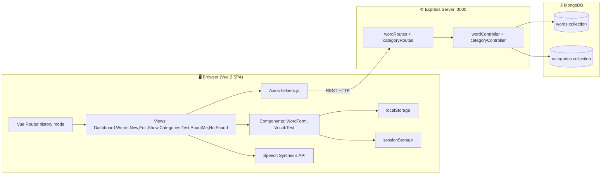
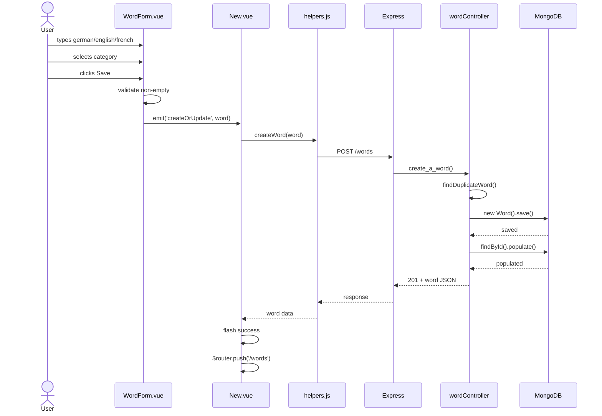
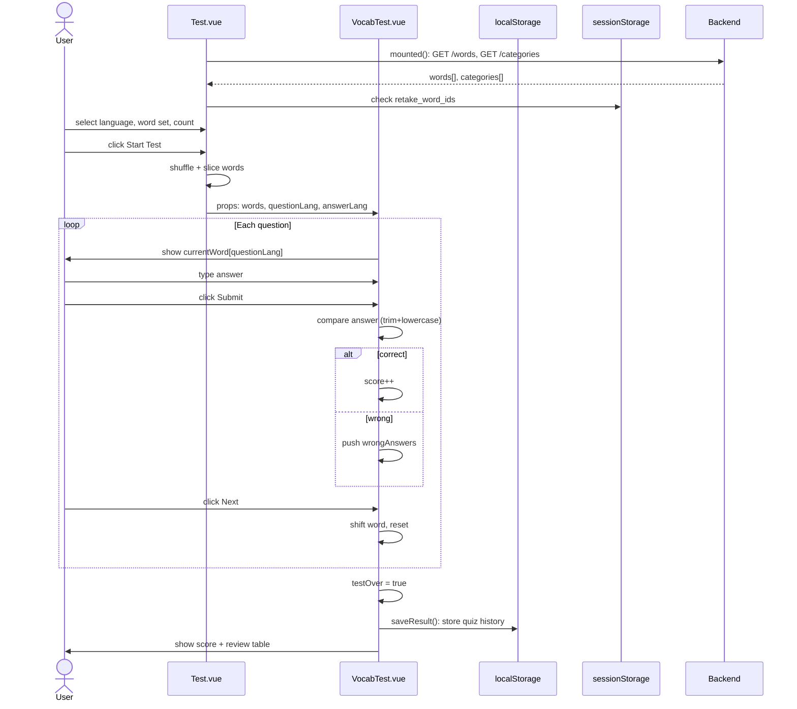
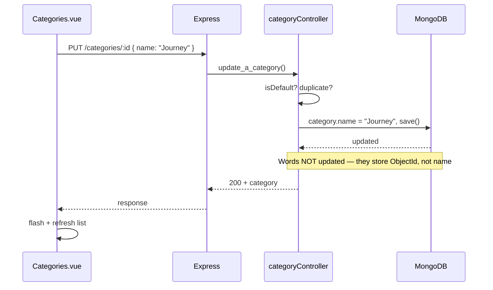

# VISUAL ASSETS, DIAGRAMS & STORYBOARD — COMPLETE SUPPLEMENT
## COMP1842 Vocabulary Builder — Video Production Guide

---

# SECTION A — VISUAL AID DECISIONS BY SCENE

| Video Section | Main Screen | Additional Visual | Reason | Duration | When |
|---|---|---|---|---|---|
| Clip 1: Introduction | Dashboard (browser) | Architecture Diagram | Shows full-stack at a glance | 20s | After first 5s intro |
| Clip 2a: Create Word | Browser (New Word form) | None — browser is enough | Form is self-explanatory | — | — |
| Clip 2b: List/Search/Filter | Browser (Words list) | None | Demo shows real filtering | — | — |
| Clip 2c: Edit/Delete | Browser | None | Quick actions | — | — |
| Clip 3: Categories | Browser (Categories page) | Storage Map overlay | Clarifies MongoDB vs browser storage | 8s | During "rename doesn't update words" |
| Clip 4a: Test Setup | Browser (Test setup) | Caption only | Simple select form | — | — |
| Clip 4b: Quiz Session | Browser (Quiz) | None | Quiz UI is visual enough | — | — |
| Clip 4c: Quiz Result | Browser (Result screen) | None | Result screen self-explanatory | — | — |
| Clip 5: Dashboard | Browser (Dashboard) | Storage Map (small) | Shows localStorage read | 5s | During history explanation |
| Clip 6: Create Code Walk | VS Code split | Sequence Diagram (Create Word) | Shows full-stack flow before code | 15s | Before opening code files |
| Clip 7: Test Code Walk | VS Code | Component Relationship Diagram | Shows Test→VocabTest props/events | 12s | Before opening Test.vue |
| Clip 8: Conclusion | Browser or VS Code | Architecture Diagram (reprise) | Bookend the presentation | 10s | Final 10 seconds |

---

# SECTION B — DIAGRAM DECISIONS (7 diagrams)

## B1. System Architecture Diagram ✅ NEEDED

**Purpose**: Show complete system at a glance. First visual in video.

**Scene**: Clip 1 Introduction — after saying "This is my full-stack Vocabulary Builder"

**Duration**: 20 seconds

**Mermaid Code**:


**Video Version (simplified)**:
```
BROWSER                EXPRESS              MONGODB
┌──────────┐    HTTP    ┌──────────┐         ┌──────────┐
│ Vue 2    │──────────→│ wordRoutes│────────→│ words    │
│ Router   │           │ catRoutes│         │ categories│
│ Axios    │←──────────│ controllers│←────────│          │
│ localStorage         └──────────┘         └──────────┘
│ sessionStorage
│ Speech API
└──────────┘
```

**Presenter Script**:
- 0:00-0:03: Show full diagram. Say "This is the system architecture."
- 0:03-0:08: Circle Browser. Say "The Vue 2 frontend handles all UI, routing, and browser storage."
- 0:08-0:13: Trace arrow to Express. Say "Axios sends REST requests to the Express backend."
- 0:13-0:18: Circle MongoDB. Say "Mongoose models map to MongoDB collections — words and categories."
- 0:18-0:20: Point to localStorage/sessionStorage. Say "Quiz history and retake data stay in the browser."

**AI Image Prompt**:
```
Create a clean system architecture diagram in 16:9 format. Title: "Vocabulary Builder — System Architecture". 
Three horizontal layers colored differently:
- TOP LAYER (blue #EFF6FF): "Browser — Vue 2 SPA" with boxes: "Vue Router (history mode)", "Views + Components", "Axios (HTTP client)", "localStorage", "sessionStorage", "Web Speech API"
- MIDDLE LAYER (green #F0FDF4): "Express Server (port 3000)" with boxes: "wordRoutes.js", "categoryRoutes.js", "wordController.js", "categoryController.js"
- BOTTOM LAYER (orange #FFF7ED): "MongoDB (COMP1842_MacXuanHoa)" with boxes: "words collection", "categories collection"
Arrows: Browser→Express labeled "REST HTTP", Express→MongoDB labeled "Mongoose"
Style: clean flat design, sans-serif font, white background, no shadows, 2px borders
Font size: minimum 18pt for readability at 1080p
Do NOT add: authentication, load balancers, caches, CDN, or any nodes not listed above
```

---

## B2. Create Word Sequence Diagram ✅ NEEDED

**Purpose**: Show full-stack data flow for the most important CRUD operation.

**Scene**: Clip 6 Full-Stack Code Walk — before opening code files

**Duration**: 15 seconds

**Mermaid Code**:


**Presenter Script**:
- 0:00-0:05: Trace User→WordForm→New. "The form emits the word object to the parent page."
- 0:05-0:10: Trace helpers→Express→controller. "Axios sends a POST request. The controller validates and saves."
- 0:10-0:15: Trace MongoDB→response→UI. "The populated word comes back. A flash message confirms success."

**AI Image Prompt**:
```
Create a sequence diagram in 16:9 format. Title: "Create Word — Full-Stack Flow".
Left-to-right sequence with 7 participants: "User", "WordForm.vue", "New.vue", "helpers.js", "Express Route", "wordController", "MongoDB"
Arrows going down:
1. User→WordForm: "types & selects"
2. WordForm→WordForm: "validate"
3. WordForm→New: "emit createOrUpdate"
4. New→helpers: "createWord()"
5. helpers→Express: "POST /words"
6. Express→wordController: "create_a_word()"
7. wordController→wordController: "findDuplicateWord()"
8. wordController→MongoDB: "save() + populate()"
Return arrows going back up (dashed, lighter color):
9. MongoDB→wordController: "populated word"
10. wordController→Express: "201 response"
11. Express→helpers→New: "word data"
12. New→New: "flash success, router.push"
Color code: User=yellow, Vue components=blue, helpers=teal, Express=green, MongoDB=orange
Style: clean technical diagram, white background, readable 16pt+ font
```

---

## B3. Vocabulary Test Sequence Diagram ✅ NEEDED

**Purpose**: Show the complex Test lifecycle — most technically impressive feature.

**Scene**: Clip 7 Test Code Flow — before opening Test.vue

**Duration**: 15 seconds

**Mermaid Code**:


**Presenter Script**:
- 0:00-0:05: Trace setup. "Test.vue loads words on mount. Check for retake session."
- 0:05-0:10: Trace quiz loop. "Each question compares the user's answer using trim and lowercase."
- 0:10-0:15: Trace result. "Results save to localStorage. NOT sent to the server."

**AI Image Prompt**:
```
Create a sequence diagram in 16:9 format. Title: "Vocabulary Test — Lifecycle".
Participants: "User", "Test.vue", "VocabTest.vue", "Backend", "localStorage", "sessionStorage"
Key flows:
- "Test.vue mounted → Backend: GET /words + GET /categories → words[] categories[]"
- "Test.vue → sessionStorage: check retake_word_ids"
- "User → Test.vue: configure test"
- "Test.vue → VocabTest.vue: props (words, languages)"
- Loop: "VocabTest → User: show question → User types → Submit → compare → score/wrong → Next"
- "VocabTest → localStorage: saveResult() stores quiz history"
Box for "ANSWER CHECKING (Browser only, no server)": compare trim().toLowerCase()
Color: Test.vue=blue, VocabTest.vue=purple, Backend=green, localStorage=yellow, sessionStorage=orange
Add annotation: "⚠ Quiz results NEVER sent to server"
```

---

## B4. Category Rename Sequence Diagram ⚠️ OPTIONAL (if time)

**Purpose**: Show efficiency of ObjectId reference — rename category without updating words.

**Scene**: Clip 3 Categories Demo — after rename demo

**Duration**: 8 seconds (only if time permits, otherwise skip)

**Mermaid Code**:


**Presenter Script**: "Because words store the category ObjectId, not the name, renaming a category instantly updates everywhere without touching word documents."

---

## B5. Storage Map ✅ NEEDED

**Purpose**: Clarify exactly where each type of data lives. Prevents the common mistake of saying "everything is in MongoDB."

**Scene**: Clip 3 and Clip 5 — as small overlay or quick reference

**Duration**: 8 seconds each appearance

**Video Version**:
```
┌─────────────────────────────────────────────────┐
│  WHERE DATA LIVES                                │
│                                                  │
│  🗄 MongoDB (permanent)                          │
│    ✓ Words (german, english, french, category)   │
│    ✓ Categories (name, isDefault)                │
│    ✓ Favourite flag                              │
│                                                  │
│  💾 localStorage (persistent)                    │
│    ✓ Quiz history (score, total, timestamp)      │
│                                                  │
│  📋 sessionStorage (tab only)                    │
│    ✓ Retake word IDs                             │
│                                                  │
│  🧠 Vue State (temporary)                        │
│    ✓ Form input, search, filters                 │
│    ✓ Current quiz words, score, answers          │
│                                                  │
│  🔊 Browser API                                  │
│    ✓ Speech Synthesis (de-DE, en-US, fr-FR)      │
└─────────────────────────────────────────────────┘
```

**AI Image Prompt**:
```
Create a storage map diagram in 16:9 format. Title: "Vocabulary Builder — Storage Map".
Four clearly separated sections with icons:
1. "🗄 MongoDB" (green) — "Words collection", "Categories collection", "Favourite field" — label: "PERMANENT"
2. "💾 localStorage" (yellow) — "Quiz history array (coursework03_quiz_history)" — label: "PERSISTENT (max 50)"
3. "📋 sessionStorage" (orange) — "Retake word IDs (retake_word_ids)" — label: "TAB LIFETIME"  
4. "🧠 Vue Component State" (blue) — "Form input", "Search/filter state", "Current quiz data" — label: "TEMPORARY"
5. "🔊 Browser API" (purple) — "Speech Synthesis" — label: "CLIENT ONLY"
Style: card-based layout, each card with icon + title + items, white background, clean borders
Font: minimum 16pt, items in bullet points
```

---

## B6. Vue Component Relationship Diagram ✅ NEEDED

**Purpose**: Show parent-child relationships, props down, events up.

**Scene**: Clip 7 — before Test.vue code walk

**Duration**: 12 seconds

**Video Version (simplified)**:
```
┌─────────────────────────────────────────┐
│              App.vue                     │
│  navbar + <router-view>                  │
└────────────┬────────────────────────────┘
             │
    ┌────────┼────────┬──────────┐
    ▼        ▼        ▼          ▼
 New.vue  Edit.vue  Test.vue   Words.vue
    │        │        │
    ▼        ▼        ▼
 WordForm  WordForm  VocabTest
 (shared)  (shared)

WordForm ──emit('createOrUpdate')──→ New.vue / Edit.vue
Test.vue ──props──→ VocabTest ──emit('exitTest')──→ Test.vue
```

**Presenter Script**: "WordForm is reused by New and Edit. Test.vue passes props down to VocabTest, which emits exitTest back up."

---

## B7. Router Map ✅ NEEDED (brief)

**Purpose**: Show SPA navigation structure.

**Scene**: Clip 1 Introduction — after architecture, before demo

**Duration**: 10 seconds

**Video Version**:
```
/ → /dashboard      Dashboard.vue
/dashboard          Dashboard.vue
/words              Words.vue
/words/new          New.vue → WordForm.vue
/words/:id          Show.vue
/words/:id/edit     Edit.vue → WordForm.vue
/categories         Categories.vue
/test               Test.vue → VocabTest.vue
/about              AboutMe.vue
*                   NotFound.vue
```

---

# SECTION C — DECISION: DIAGRAM vs CODE vs BROWSER

| Topic | Browser | Code | Diagram | Best Choice | Reason |
|---|---|---|---|---|---|
| System overview | ❌ | ❌ | ✅ Architecture | Diagram shows big picture faster than either |
| Create Word flow | ✅ Demo first | ✅ After | ✅ Sequence before code | Show result, then explain how |
| Search/Filter | ✅ Real demo | ✅ filteredWords computed | ❌ | Browser shows real filtering; code shows logic |
| Category rename | ✅ Demo | ✅ controller code | ⚠️ Optional | Browser shows rename; code shows no word update |
| Test lifecycle | ✅ Demo quiz | ✅ startTest + submitAnswer | ✅ Sequence | Complex flow benefits from diagram first |
| Quiz answer checking | ✅ Demo | ✅ submitAnswer code | ❌ | Code is simple enough to show directly |
| localStorage/sessionStorage | ❌ | ✅ saveResult code | ✅ Storage map | Diagram clarifies where data lives |
| Dashboard stats | ✅ Demo | ✅ mounted code | ❌ | Browser is clear enough |
| Speech synthesis | ✅ Demo | ✅ speakWord code | ❌ | Very simple, browser demo sufficient |
| Component relations | ❌ | ❌ | ✅ Component map | Shows reuse of WordForm, Test→VocabTest |
| Route navigation | ❌ | ✅ router.js | ✅ Route map | Route map faster; code for detail |

---

# SECTION D — COMPLETE VISUAL STORYBOARD (second-by-second)

## CLIP 1: Introduction (0:00–0:35)

### 0:00–0:05
- **Screen**: Dashboard (browser)
- **Action**: Show dashboard already loaded with data
- **Cursor**: Stationary
- **Caption**: "COMP1842 — Vocabulary Builder — Mạc Xuân Hòa"
- **Speak**: "This is my COMP1842 Vocabulary Builder — a full-stack multilingual learning application."
- **Result visible**: Dashboard with stats and quiz history

### 0:05–0:10
- **Screen**: Still Dashboard — point to navbar
- **Action**: Move cursor across 6 nav links slowly
- **Caption**: None
- **Speak**: "Built with Vue 2, Express, and MongoDB. Six main sections: Dashboard, Words, Add Word, Categories, Test, and About Me."

### 0:10–0:30
- **Screen**: **DIAGRAM** — Architecture Diagram (full screen)
- **Action**: Show diagram, cursor follows speech
- **Caption**: "System Architecture"
- **Speak**: (see B1 presenter script above)
- **Transition**: Diagram fades. "Let me show you the app in action."

### 0:30–0:35
- **Screen**: **DIAGRAM** — Router Map (10s)
- **Action**: Quick flash of route map
- **Speak**: "Ten routes managed by Vue Router in history mode. Every page is a single-page navigation."

---

## CLIP 2: CRUD Words Demo (0:35–1:50)

### 0:35–0:45
- **Screen**: Words page (browser)
- **Action**: Show populated word list
- **Cursor**: Point to columns — English, German, French, Category, Actions
- **Speak**: "The Words page lists all vocabulary. Three languages per entry. Star icon for favourites. Actions for view, edit, delete."

### 0:45–1:05
- **Screen**: Add Word form (browser)
- **Action**: 
  1. Click "Add New Word" button
  2. Click German input → type "Haus"
  3. Tab → type "house"
  4. Tab → type "maison"
  5. Click Category dropdown → select "General"
  6. Click "Save word"
- **Cursor**: Pause briefly on each input label
- **Caption** (when typing French): "Third language: French"
- **Speak**: "The form collects all three translations. Category is a dropdown populated from the database. Frontend validates that all fields are filled."
- **Result**: Flash message "Word created successfully!" appears; redirects to words list
- **DO NOT say**: "The word is now in MongoDB" (say that during code walk)

### 1:05–1:25
- **Screen**: Words list (browser)
- **Action**: 
  1. Click star on a word → star turns yellow
  2. Type "haus" in search box → list filters
  3. Select "Travel" in category filter → show filtered
  4. Switch sort to "Oldest Added"
- **Cursor**: Follow each action
- **Caption**: "Client-side search, filter, sort"
- **Speak**: "Search, filter, and sort all happen instantly in the browser using Vue computed properties — no server request needed."
- **Transition**: Clear search/filters

### 1:25–1:50
- **Screen**: Words list → Edit form → back to list
- **Action**:
  1. Click Edit icon on a word → Edit form opens with pre-filled data
  2. Change English field → click Save
  3. Back to list — word updated
  4. Click Delete icon on another word → confirm → removed
- **Speak**: "Edit loads the existing word, populated with its category. Delete removes it after confirmation."
- **Transition**: "Now let me show how categories are managed."

---

## CLIP 3: Categories Demo (1:50–2:30)

### 1:50–2:00
- **Screen**: Categories page (browser)
- **Action**: Show category list
- **Cursor**: Point to "General (Default)" badge
- **Speak**: "Categories have their own management page. General is the default category — it cannot be edited or deleted."

### 2:00–2:10
- **Screen**: Categories page
- **Action**:
  1. Type "Travel" in Add input
  2. Click "Add" → appears in table
- **Speak**: "Creating a new category is instant."

### 2:10–2:20
- **Screen**: Categories page
- **Action**:
  1. Click Edit on "Travel" → inline edit appears
  2. Change to "Journey" → press Enter → name updates
- **Cursor**: Point to the renamed category
- **Caption**: "Category stores ObjectId — words unaffected"
- **Speak**: "Renaming a category does NOT update any word documents. Words store the category ObjectId, not the name."
- **Screen**: Quick overlay of **Storage Map** (8s) — highlight "Words reference categories by ObjectId"
- **Speak**: "This is one advantage of the reference design."

### 2:20–2:30
- **Screen**: Categories page
- **Action**:
  1. Try clicking Delete on "General" → shows "Locked"
  2. Click Delete on empty category → confirm → removed
- **Speak**: "The default category is protected. Regular categories can be deleted — the backend reassigns any words to the default first."
- **Transition**: "Now the most complex feature — the vocabulary test."

---

## CLIP 4: Vocabulary Test Demo (2:30–3:30)

### 2:30–2:45
- **Screen**: Test setup page (browser)
- **Action**:
  1. Point to Question Language dropdown — set to "German"
  2. Point to Answer Language dropdown — set to "English"
  3. Point to Word set — set to "All words"
  4. Point to Questions — set to "5"
- **Speak**: "The test setup lets you choose language direction, word source, and question count. If the same language is selected twice, it auto-swaps to prevent trivial questions."

### 2:45–3:15
- **Screen**: Quiz session (browser)
- **Action**:
  1. Click "Start Test" → quiz begins
  2. First question: German word shown, type English answer → click Submit
  3. "Correct!" feedback appears → click Next
  4. Answer 3 more correctly
  5. On 5th question: answer wrong intentionally
  6. "Incorrect — the correct answer is: X" appears
- **Cursor**: Follow the question → answer input → submit button
- **Caption** (on correct): "trim().toLowerCase() comparison"
- **Caption** (on progress): "Vue computed: answeredCount/totalQuestions"
- **Speak**: "Each answer is compared using case-insensitive trimmed comparison — all in the browser. No request is sent to the server during the quiz."

### 3:15–3:30
- **Screen**: Quiz result screen (browser)
- **Action**: Show result screen
- **Cursor**: Point to score, then review table
- **Speak**: "Score 4 out of 5. Wrong answers are shown in a review table. Results are saved to localStorage for the dashboard."
- **Action**: Click "Back to Setup"
- **Transition**: "The dashboard shows your progress over time."

---

## CLIP 5: Dashboard + Retake (3:30–4:05)

### 3:30–3:45
- **Screen**: Dashboard (browser)
- **Action**: 
  1. Point to stat row: total words, favourites, categories
  2. Point to quiz history table
- **Speak**: "The dashboard shows totals and recent quiz attempts with score percentages."

### 3:45–3:55
- **Screen**: Dashboard → Test (retake)
- **Action**:
  1. Click "Retake" on a quiz attempt
  2. Quiz starts immediately with the same set of words
- **Caption**: "sessionStorage → retake_word_ids"
- **Speak**: "Retake stores the word IDs in sessionStorage, so the test page can load them and start immediately."
- **Action**: Exit test → back to setup
- **Overlay**: Small **Storage Map** (5s) — highlight sessionStorage section

### 3:55–4:05
- **Screen**: Dashboard (browser)
- **Speak**: "The average of your last 5 quiz attempts is shown here — computed from localStorage data."
- **Transition**: "Let me walk through the code that makes all this work."

---

## CLIP 6: Full-Stack Code Walk (4:05–5:00)

### 4:05–4:20
- **Screen**: **DIAGRAM** — Create Word Sequence Diagram (15s)
- **Action**: Show sequence diagram, cursor traces the flow
- **Caption**: "Create Word — Full-Stack Flow"
- **Speak**: (see B2 presenter script)

### 4:20–4:28
- **Screen**: VS Code — `WordForm.vue` — scroll to `onSubmit()`
- **Highlight**: Lines showing `$emit('createOrUpdate', {...})`
- **Zoom**: 1.2x on the emit line
- **Speak**: "The form validates inputs, handles category creation, then emits the word object to the parent."

### 4:28–4:35
- **Screen**: VS Code — `New.vue` — `createOrUpdate()`
- **Highlight**: `await createWord(word)` and `this.flash(...)`
- **Speak**: "The parent receives the event, calls the Axios helper, and shows a flash message on success."

### 4:35–4:42
- **Screen**: VS Code — `helpers.js` — `createWord` export
- **Highlight**: `apiClient.post('/words', word)`
- **Speak**: "The helper sends a POST request to the Express backend."

### 4:42–4:50
- **Screen**: VS Code — `wordController.js` — `create_a_word`
- **Highlight**: Default category logic + `findDuplicateWord` + `new Word(req.body).save()`
- **Speak**: "The controller assigns a default category if none is provided, checks for duplicates, then saves to MongoDB via Mongoose."

### 4:50–4:55
- **Screen**: Split — `wordController.js` left, browser right
- **Highlight**: `.populate('category', 'name isDefault')` line
- **Speak**: "The response populates the category with name and isDefault flag, so the frontend can display it immediately."

### 4:55–5:00
- **Screen**: VS Code — `wordModel.js` — WordSchema
- **Highlight**: `category: { type: mongoose.Schema.Types.ObjectId, ref: 'Categories' }`
- **Speak**: "The schema defines category as an ObjectId reference to the Categories collection — not a string."
- **Transition**: "Now the test logic — the most complex frontend feature."

---

## CLIP 7: Test Code Flow (5:00–5:40)

### 5:00–5:07
- **Screen**: **DIAGRAM** — Component Relationship (12s, start at 5:00)
- **Speak**: "Test.vue passes props down to VocabTest. VocabTest emits exitTest back up. WordForm is shared by New and Edit."

### 5:07–5:20
- **Screen**: VS Code — `Test.vue` — `startTest()`
- **Highlight**: Shuffle + slice logic
- **Speak**: "startTest shuffles the available words and slices to the question count. Then it sets testWords and switches to the quiz view."

### 5:20–5:30
- **Screen**: VS Code — `VocabTest.vue` — `submitAnswer()`
- **Highlight**: The trim+lowercase comparison
- **Zoom**: 1.3x on comparison line
- **Caption**: "Browser-only comparison — no server request"
- **Speak**: "Answer checking is pure browser logic. The user's answer is trimmed and lowercased, then compared to the correct answer. No API call."

### 5:30–5:40
- **Screen**: VS Code — `VocabTest.vue` — `saveResult()`
- **Highlight**: localStorage.setItem line
- **Speak**: "Results are stored in localStorage as a JSON array. The dashboard reads this same key to show quiz history."
- **Screen**: Quick switch to `Dashboard.vue` — `mounted()` localStorage read
- **Speak**: "Here the dashboard reads quiz history from localStorage."
- **Transition**: "To conclude..."

---

## CLIP 8: Evaluation + Conclusion (5:40–6:30)

### 5:40–5:50
- **Screen**: Browser (Dashboard)
- **Speak**: "Vue's reactive computed properties made search and filter seamless. The REST API separation keeps code organized."

### 5:50–6:00
- **Screen**: Split — `categoryController.js` left, browser right
- **Highlight**: `delete_a_category` — Word.updateMany line
- **Speak**: "Category ObjectId references mean renaming is instant and deletion cleanly reassigns words."

### 6:00–6:10
- **Screen**: **DIAGRAM** — Architecture Diagram (reprise, 10s)
- **Speak**: "MongoDB fits vocabulary data naturally. Browser storage is appropriate for non-critical quiz data. Speech synthesis adds accessibility."

### 6:10–6:20
- **Screen**: Browser (any page)
- **Speak**: "Future improvements: user authentication, spaced repetition, more languages, mobile responsive design."

### 6:20–6:30
- **Screen**: Dashboard
- **Caption**: "Thank you — Mạc Xuân Hòa — COMP1842"
- **Speak**: "Thank you for watching. This is my COMP1842 Vocabulary Builder project."

---

# SECTION E — CAPTION PLAN

| Timestamp | Caption | Position | Duration | Purpose |
|---|---|---|---|---|
| 0:00 | "COMP1842 — Vocabulary Builder" | Bottom center | 5s | Title card |
| 0:10 | "System Architecture" | Top center | 20s | Diagram label |
| 0:30 | "10 routes — Vue Router history mode" | Bottom | 5s | Router map |
| 0:48 | "Third language: French" | Near French input | 4s | Highlight feature |
| 1:05 | "Client-side search, filter, sort" | Bottom | 8s | Explain no server call |
| 1:08 | "Computed property: filteredWords" | Bottom | 6s | Code reference |
| 2:15 | "Category stores ObjectId — words unaffected" | Bottom | 6s | Key architecture point |
| 3:00 | "trim().toLowerCase() comparison" | Bottom | 4s | Code reference |
| 3:05 | "Computed: answeredCount/totalQuestions" | Bottom | 4s | Code reference |
| 3:50 | "sessionStorage → retake_word_ids" | Bottom | 5s | Storage clarification |
| 4:20 | "emit('createOrUpdate')" | Over code | 4s | Code highlight |
| 5:25 | "Browser-only comparison — no server request" | Bottom | 6s | Critical clarification |
| 6:25 | "Thank you — Mạc Xuân Hòa — COMP1842" | Center | 5s | Closing |

---

# SECTION F — CODE HIGHLIGHT PLAN

| Scene | File | Code Section | Highlight | Speak | Seconds |
|---|---|---|---|---|---|
| Clip 6a | `WordForm.vue` | `onSubmit()` lines ~130-175 | `this.$emit('createOrUpdate', {...})` | "The form emits the word object" | 8s |
| Clip 6b | `New.vue` | `createOrUpdate()` lines ~42-50 | `await createWord(word)` | "Parent calls the API helper" | 7s |
| Clip 6c | `helpers.js` | `createWord` export line ~8 | `apiClient.post('/words', word)` | "Axios POST request" | 7s |
| Clip 6d | `wordRoutes.js` | Route definition line ~6 | `.post(wordController.create_a_word)` | "Route maps to controller" | 5s |
| Clip 6e | `wordController.js` | `create_a_word` lines ~25-45 | `findDuplicateWord` + `new Word(req.body).save()` | "Duplicate check then save" | 10s |
| Clip 6f | `wordModel.js` | WordSchema lines ~4-30 | `category: { type: ObjectId, ref: 'Categories' }` | "ObjectId reference, not string" | 5s |
| Clip 7a | `Test.vue` | `startTest()` | Shuffle + slice + `isSessionActive = true` | "Shuffles and starts session" | 10s |
| Clip 7b | `VocabTest.vue` | `submitAnswer()` | `correctVal === userVal` comparison | "Case-insensitive comparison" | 10s |
| Clip 7c | `VocabTest.vue` | `saveResult()` | `localStorage.setItem(...)` | "Saves to localStorage" | 8s |
| Clip 7d | `Dashboard.vue` | `mounted()` | `localStorage.getItem(...)` | "Reads quiz history" | 5s |

---

# SECTION G — AI IMAGE GENERATION PROMPTS (copy-paste ready)

## Prompt 1: Architecture Diagram
```
Create a clean system architecture diagram. 16:9 aspect ratio. White background. Title "Vocabulary Builder — System Architecture" at top in dark sans-serif font.

THREE HORIZONTAL LAYERS with distinct background colors:
1. TOP (light blue #EFF6FF, label "Browser — Vue 2 SPA"): boxes for "Vue Router (history mode)", "Views + Components", "Axios helpers.js", "localStorage", "sessionStorage", "Web Speech API"
2. MIDDLE (light green #F0FDF4, label "Express Server :3000"): boxes for "wordRoutes.js", "categoryRoutes.js", "wordController.js", "categoryController.js"  
3. BOTTOM (light orange #FFF7ED, label "MongoDB"): boxes for "words collection", "categories collection"

ARROWS: solid arrows Browser→Express labeled "REST HTTP", Express→MongoDB labeled "Mongoose"
Dashed return arrows back up labeled "JSON response"

STYLE: flat design, 2px rounded borders, no shadows, no gradients, sans-serif font minimum 16pt
DO NOT ADD: authentication, load balancer, CDN, cache, or any node not listed
```

## Prompt 2: Create Word Sequence Diagram
```
Create a sequence diagram. 16:9. White background. Title "Create Word — Full-Stack Flow".

Vertical lifelines (7 columns, left to right): "User", "WordForm.vue", "New.vue", "helpers.js", "Express Route", "wordController", "MongoDB"

Arrows going DOWN (solid, dark colors):
1. User → WordForm: "types & selects"
2. WordForm → WordForm: "validate non-empty"
3. WordForm → New: "emit createOrUpdate"
4. New → helpers: "createWord()"
5. helpers → Express: "POST /words"
6. Express → wordController: "create_a_word()"
7. wordController → MongoDB: "save() + populate()"

Return arrows going UP (dashed, lighter):
8. MongoDB → wordController: "populated word"
9. wordController → Express → helpers → New: "201 response"
10. New → New: "flash + router.push"

Color boxes: User=yellow, Vue=blue, helpers=teal, Express=green, MongoDB=orange
Font: sans-serif 14pt minimum. Clean technical style.
```

## Prompt 3: Vocabulary Test Sequence Diagram
```
Create a sequence diagram. 16:9. White background. Title "Vocabulary Test — Full Lifecycle".

6 lifelines: "User", "Test.vue", "VocabTest.vue", "Backend", "localStorage", "sessionStorage"

Key interactions:
- Test.vue → Backend: "GET /words + /categories"
- Test.vue → sessionStorage: "check retake_word_ids"
- User → Test.vue: "configure test"
- Test.vue → VocabTest.vue: "props: words, languages"
- Loop box around: VocabTest → User: "show question → type → Submit → compare → score/wrong → Next"
- VocabTest → localStorage: "saveResult()"

Annotation box (red border): "⚠ Answer checking: Browser only. trim().toLowerCase() comparison. No server request."

Colors: Test.vue=blue, VocabTest.vue=purple, Backend=green, localStorage=yellow, sessionStorage=orange
Font: sans-serif 14pt. Clean style.
```

## Prompt 4: Storage Map
```
Create a storage map infographic. 16:9. White background. Title "Vocabulary Builder — Storage Map".

Five cards in a row, each with icon + title + bullet points:

Card 1 (green #F0FDF4): "🗄 MongoDB" — "Words collection", "Categories collection", "Favourite field" — badge: "PERMANENT"
Card 2 (yellow #FEFCE8): "💾 localStorage" — "Quiz history array", "Key: coursework03_quiz_history" — badge: "PERSISTENT"
Card 3 (orange #FFF7ED): "📋 sessionStorage" — "Retake word IDs", "Key: retake_word_ids" — badge: "TAB LIFETIME"
Card 4 (blue #EFF6FF): "🧠 Vue State" — "Form input", "Search/filter", "Quiz session data" — badge: "TEMPORARY"
Card 5 (purple #FAF5FF): "🔊 Browser API" — "Speech Synthesis", "de-DE, en-US, fr-FR" — badge: "CLIENT ONLY"

Style: card-based, rounded corners 8px, subtle borders, clean sans-serif font 14pt+
```

## Prompt 5: Vue Component Relationships
```
Create a component relationship diagram. 16:9. White background. Title "Vue Component Hierarchy".

Show parent-child relationships with boxes and arrows:

Top: "App.vue" box — below it "router-view"
Below: 4 boxes in a row: "New.vue", "Edit.vue", "Test.vue", "Words.vue"
Below New and Edit: shared box "WordForm.vue" with label "♻ REUSED"
Below Test: box "VocabTest.vue"

Arrows:
- New → WordForm: "props: word"
- Edit → WordForm: "props: word"  
- WordForm → New/Edit: dashed arrow "emit: createOrUpdate"
- Test → VocabTest: solid arrow "props: words, languages"
- VocabTest → Test: dashed arrow "emit: exitTest"

Colors: App=dark blue, pages=blue, components=light blue
Font: sans-serif 14pt+. Clean, minimal style.
```

---

# SECTION H — SCREENSHOT PREPARATION LIST

| Screenshot | How to Prepare | Used In | Capture Before? |
|---|---|---|---|
| Dashboard with data | Insert demo dataset, run a quiz first | Clip 1, 5, 8 | **Yes** |
| Words list populated | 15 words inserted | Clip 2 | **Yes** |
| Empty Add Word form | Navigate to /words/new | Clip 2 | No (record live) |
| Flash success message | Create a word during recording | Clip 2, 3 | No (live) |
| Category list with 4 categories | Insert categories beforehand | Clip 3 | **Yes** |
| General "Default" badge | Visible on category page | Clip 3 | **Yes** |
| Inline edit on category | Click Edit during recording | Clip 3 | No (live) |
| Test setup with ≥5 words | Navigate to /test | Clip 4 | **Yes** |
| Correct answer feedback | Answer correctly during quiz | Clip 4 | No (live) |
| Wrong answer feedback | Answer wrong intentionally | Clip 4 | No (live) |
| Quiz result screen | Complete quiz with 1 wrong | Clip 4 | No (live) |
| Dashboard with history | Run quiz before recording | Clip 5 | **Yes** |
| Retake in session | Click Retake during recording | Clip 5 | No (live) |
| VS Code with project open | Open project folder | Clip 6, 7 | **Yes** |
| Server terminal running | `node server.js` output | Clip 6 | **Yes** |

---

# SECTION I — FINAL VISUAL CHECKLIST

```
BEFORE RECORDING:
  [ ] Architecture Diagram image created (AI or manual)
  [ ] Create Word Sequence Diagram image created
  [ ] Test Sequence Diagram image created
  [ ] Storage Map image created
  [ ] Component Relationship Diagram image created
  [ ] All diagrams at 1920×1080 resolution
  [ ] Demo dataset inserted in MongoDB
  [ ] At least 1 quiz history entry in localStorage
  [ ] sessionStorage EMPTY
  [ ] VS Code open with project, font size 16+
  [ ] Browser at 100% zoom, no extensions visible
  [ ] Screen recorder tested

DURING RECORDING:
  [ ] Diagrams shown as full-screen images
  [ ] Each diagram: show → speak → cursor trace → transition
  [ ] Code: open file → scroll to method → highlight → speak → close
  [ ] Browser: navigate → explain → interact → show result
  [ ] Flash messages: wait for them to appear before moving on
  [ ] Transitions: diagram fades, browser or code appears cleanly

AFTER RECORDING:
  [ ] Add captions at specified timestamps
  [ ] Trim any awkward pauses
  [ ] Verify total duration ≤ 7:00
  [ ] Check audio levels consistent
  [ ] Export at 1080p
```
